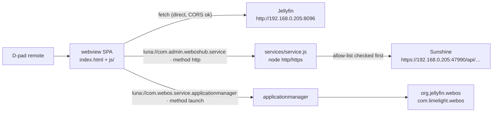

# Architecture

## Problem

The hub must render Jellyfin media and Sunshine apps inside one webOS webview. Two constraints make
that non-obvious: browsers forbid cross-origin requests without CORS consent, and a web app cannot
open raw sockets. Jellyfin cooperates; Sunshine does not.

## Solution

### Webview SPA

The UI is a single page (`index.html`) that loads six plain-script modules in order. There is no
framework and no build step for the app itself.

| File | Role |
| --- | --- |
| `index.html` | App shell, Home and Settings screens, script loading order. |
| `js/config.js` | Settings module over `localStorage` (no credentials in source). |
| `js/focus.js` | D-pad spatial navigation (`.focused` class, geometric nearest-neighbour). |
| `js/jellyfin.js` | Jellyfin REST client on top of `fetch`. |
| `js/sunshine.js` | Sunshine client, routed through the bundled Luna service. |
| `js/launcher.js` | `applicationmanager` `launch` wrapper (deep links). |
| `js/app.js` | Bootstrap, screen switching, row/poster rendering, error surfacing. |
| `css/style.css` | Dark 1920x1080 TV theme and the focus ring. |

### Why Sunshine needs a bundled Luna service

- **Jellyfin is CORS-permissive.** It answers with `Access-Control-Allow-Origin: *` and its
  preflight allows `authorization, x-emby-authorization, content-type`, so `js/jellyfin.js` calls it
  **directly** with `fetch`.
- **Sunshine is not CORS-enabled.** It sends no `Access-Control-Allow-Origin` and its preflight
  `OPTIONS` fails, so a direct browser request is blocked. A webview cannot work around that, so
  Sunshine requests are delegated to a bundled webOS **Luna service** that performs them from Node.

### Request flow



The Luna method returns `{returnValue, status, headers, body}`; `js/sunshine.js` parses `body` as
JSON and surfaces every failure inline.

### Proxy security model

Because the service uses a public id, **any** app on the TV may call it. The proxy is therefore a
*restricted* one, never an open forward proxy.

| Guard | Behaviour |
| --- | --- |
| Origin allow-list | `ALLOWED_ORIGINS` ships with one entry: `https://192.168.0.205:47990`. |
| Path allow-list | `ALLOWED_PATH_PREFIXES = ['/api/']` — only Sunshine's REST API is reachable. |
| Blocked hostnames | `localhost`, `127.*`, `::1` / `[::1]`, `0.0.0.0`, `169.254.*` are always rejected. |
| Response cap | `MAX_BODY_BYTES = 5 * 1024 * 1024`; larger bodies abort the request. |
| Timeout | 15 s (`DEFAULT_TIMEOUT_MS`). |
| TLS | `rejectUnauthorized: false` **only** for allow-listed `https:` origins (Sunshine self-signed). |
| Fail-closed | A rejected origin or path returns `errorCode: 3` naming the rejected value; no socket opens. |

There is **no caller-controlled `insecure` flag**: TLS relaxation is keyed off the validated origin,
never off the request payload, so no caller can disable certificate validation for an arbitrary host.

### Settings and secrets

- `js/config.js` stores every setting in one `localStorage` key, `webosHub.settings.v1`, overlaying
  stored values on defaults (`jellyfinUrl` `http://192.168.0.205:8096`, `sunshineUrl`
  `https://192.168.0.205:47990`, plus user/password and an optional `moonlightHostUuid`).
- `js/jellyfin.js` keeps a stable device id under `webosHub.deviceId.v1`, built jellyfin-web style:
  `btoa([navigator.userAgent, Date.now()].join('|'))`.
- **No credentials are committed.** Defaults are URLs only; credentials exist solely on the TV and,
  for the smoke test, in environment variables.

### ACG declaration

`appinfo.json` declares `requiredACG: ["application.launcher"]`. The hub calls
`com.webos.applicationManager` method `launch`, which the LG ACG guide maps to the group
`application.launcher`. An empty array is valid only for apps that call no Luna API at all, so `[]`
would be wrong here. The bundled service calls no public Luna API of its own, so it adds no further
group.

## When to use

- Reading path: any question about how a request reaches Jellyfin or Sunshine, or what the proxy
  will refuse.
- Changing path: adding a request path or a new target origin requires editing the allow-lists in
  `services/service.js` and rebuilding.

## When not to use

- Distribution and releases: see [hbc-distribution-plan](hbc-distribution-plan.md) and the
  [release protocol](../protocols/release-protocol.md).
- Launch parameters and deep links: see [deep-link-findings](deep-link-findings.md).

## Examples

Calling the proxy from the webview:

```js
webOS.service.request('luna://com.admin.weboshub.service', {
  method: 'http',
  parameters: { url: 'https://<sunshine>/api/apps', method: 'GET', headers: { Authorization: 'Basic …' } },
  onSuccess: function (res) { /* { returnValue, status, headers, body } */ },
  onFailure: function (err) { /* err.errorText names the rejected origin or path */ }
});
```

## Common mistakes

### Sunshine row is empty / bundled service required

In a desktop browser there is no `webOS` global, so `js/sunshine.js` falls back to a direct `fetch`,
which Sunshine blocks (no CORS). This is expected: on a TV the bundled service handles the call. The
app surfaces the reason instead of rendering nothing.

### Adding a Sunshine path but forgetting the allow-list

`ALLOWED_PATH_PREFIXES` only permits `/api/`. A new endpoint outside that prefix is rejected with
`errorCode: 3` until the constant is updated and the app is rebuilt.

### Editing the Sunshine URL in Settings and expecting it to work

The Settings field changes the URL the webview asks for, but the service still validates against the
hardcoded `ALLOWED_ORIGINS`. A different host needs a source edit and a release.

## References

- [HBC distribution plan](hbc-distribution-plan.md)
- [Deep-link findings](deep-link-findings.md)
- [Release protocol](../protocols/release-protocol.md)
- [Project entry point](../project.md)
